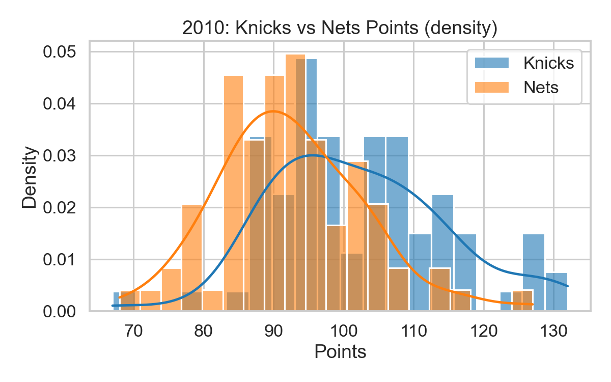
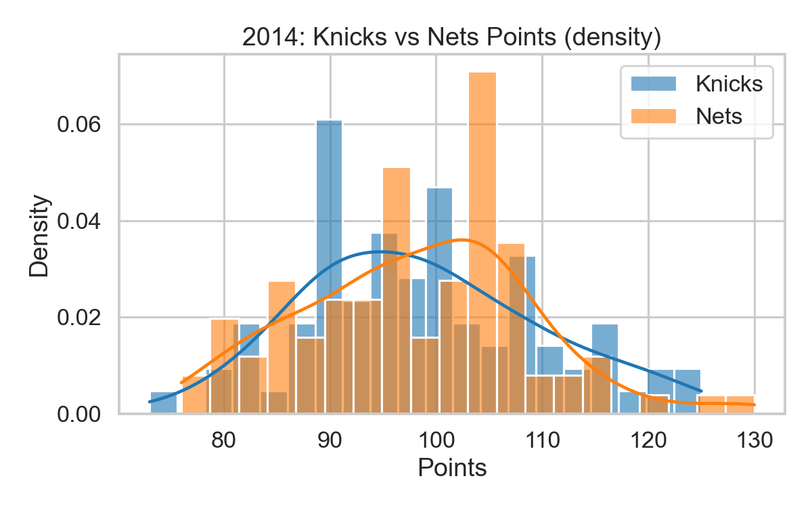
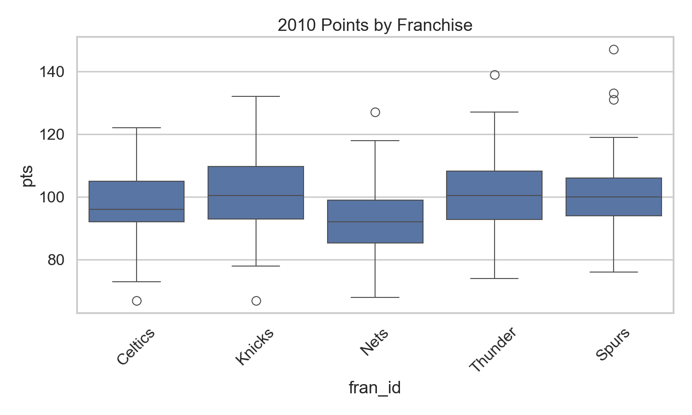
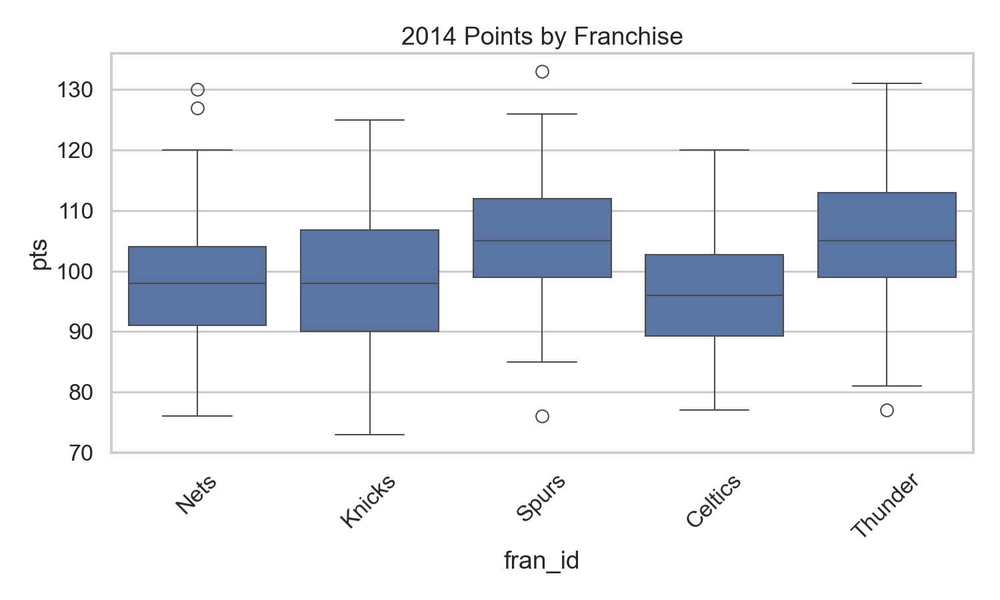
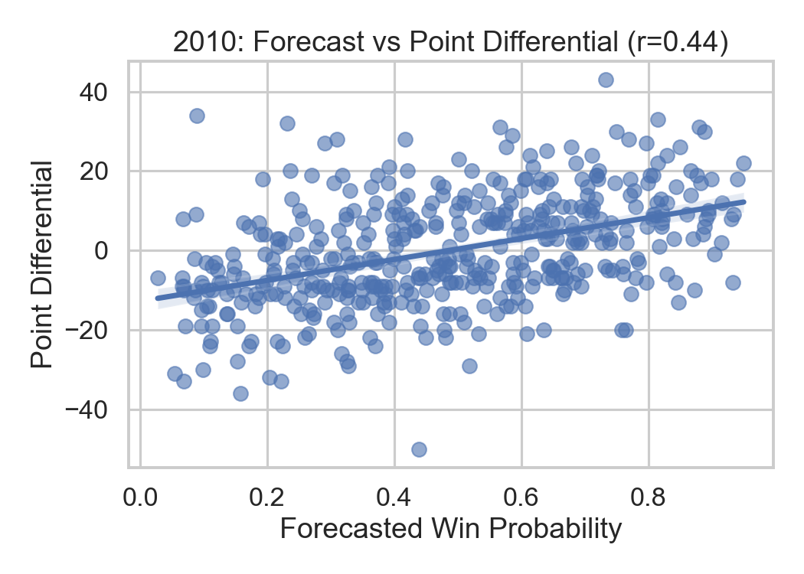
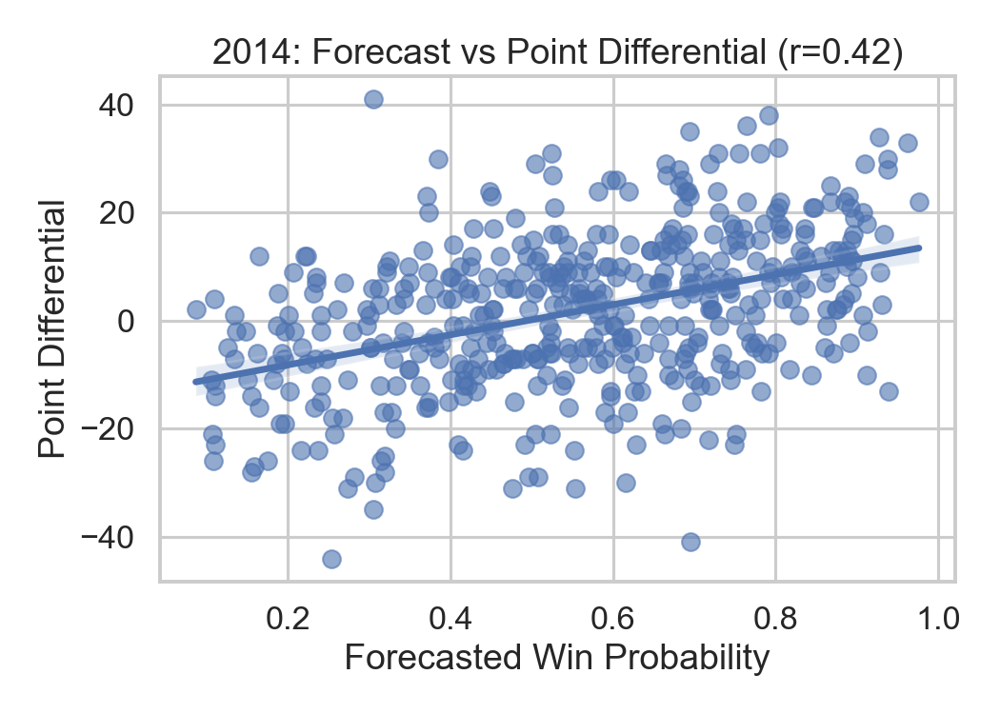

# NBA Trends — Data Analysis 📊

This repository contains a small analysis of NBA game results focused on the Knicks and Nets across selected seasons (2010 and 2014). The analysis compares team scoring, assesses whether game location is associated with game outcome, and inspects whether forecasted win probability correlates with point differential.

---

## Files
- `nba_games.csv` — dataset used for the analysis
- `nba_trends_analysis.py` — refactored analysis script (prints results and generates plots)
- `figures/` — contains generated PNG plots referenced below

---

## Key Findings (summary) ✅

- **2010 (Knicks vs Nets)**
  - Mean points: Knicks ≈ 102.11, Nets ≈ 92.38 (n=82 each)
  - **Mean difference = 9.73** (Knicks − Nets)
  - **Welch t-test:** t = 5.384, p ≈ 2.63e-07 → statistically significant
  - **Cohen's d ≈ 0.84 (large)** → difference is also practically meaningful
  - **Game location** and **game result** show an association (chi2 p ≈ 0.0108)
  - **Forecast vs point differential:** Pearson r ≈ 0.44 (moderate, p ≪ 0.001)

- **2014 (Knicks vs Nets)**
  - Mean points: Knicks ≈ 98.59, Nets ≈ 98.14
  - **Mean difference ≈ 0.45** (not statistically significant; p ≈ 0.787)
  - **Cohen's d ≈ 0.04 (negligible)**
  - **Game location** and **game result** show an association (chi2 p ≈ 7.7e-04)
  - **Forecast vs point differential:** Pearson r ≈ 0.42 (moderate)

> **Interpretation:** In 2010 the Knicks were clearly scoring more than the Nets (large effect size and highly significant), while in 2014 there is no evidence of a meaningful scoring difference between the two teams. In both seasons, game location is associated with results, and forecasted win probability moderately correlates with point differential (forecasts contain useful information about margin).

---

## Plots (click to view)

### Distribution of points (Knicks vs Nets)

2010:



2014:



---

### Boxplots by franchise

2010:



2014:



---

### Forecast vs Point Differential (regression)

2010:



2014:



---

## Reproduce the analysis

1. Ensure `nba_games.csv` is in the project folder.
2. Run:

```
python nba_trends_analysis.py
```

3. The script prints summaries and saves plots to the `figures/` folder.

---

## Notes & next steps

- The script prints p-values and effect sizes; always consider both statistical significance and effect size when interpreting results.
- If you'd like, I can:
  - Add an automated report (Markdown or HTML) that includes the tables and the figures, or
  - Add unit tests to validate the numeric summaries.

---

If you want the README updated (formatting, more explanation, or additional plots), tell me which sections to expand. 👇